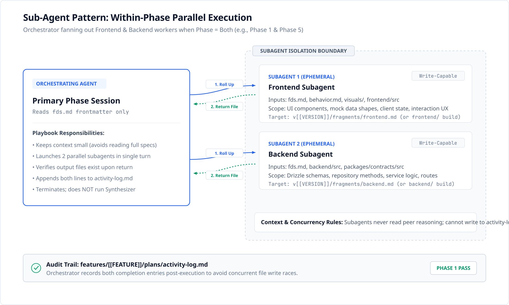
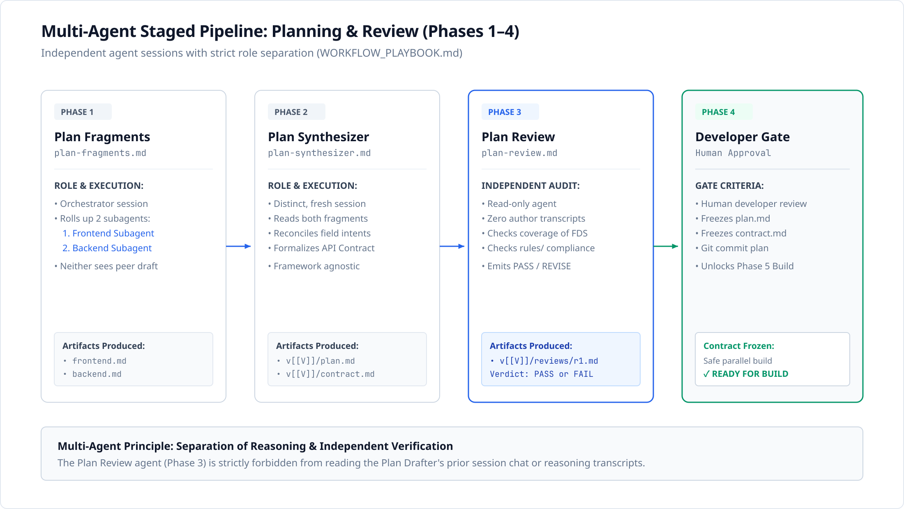
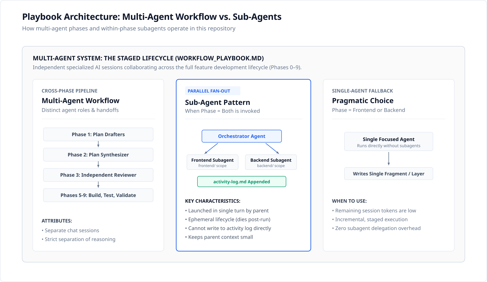

# Multi-Agent Workflow vs. Sub-Agents: Project Architecture Guide

This document clarifies the concepts of **Multi-Agent Systems (MAS)** and **Sub-Agents** as implemented in our repository's **Staged Dual-Validation Workflow with Multi-Agent Parallel Execution** (`WORKFLOW_PLAYBOOK.md` and `.ai/prompts/`).

---

## 1. Executive Summary: Core Distinction in Our Project

| Concept                  | Scope in This Repository                                                 | Key Responsibility                                                                                                                                       | Lifecycle                                                                                                                                                      |
| :----------------------- | :----------------------------------------------------------------------- | :------------------------------------------------------------------------------------------------------------------------------------------------------- | :------------------------------------------------------------------------------------------------------------------------------------------------------------- |
| **Multi-Agent Workflow** | The **Cross-Phase Pipeline** (Phases 0 through 9)                        | The overall system where independent AI agent sessions execute specialized roles across the feature lifecycle.                                           | Distinct agent sessions per phase (e.g. Plan Drafter $\rightarrow$ Plan Synthesizer $\rightarrow$ Plan Reviewer $\rightarrow$ Builders $\rightarrow$ Testers). |
| **Sub-Agent Pattern**    | The **Within-Phase Parallelism** (Phase 1 & Phase 5 with `Phase = Both`) | An ephemeral child worker spawned concurrently by the primary phase agent (Orchestrator) to handle a single decoupled layer (`frontend/` or `backend/`). | **Ephemeral**: Spawned together in a single turn, drafts or builds its bounded scope, and terminates immediately upon return.                                  |

> **Key Rule:**  
> The overall project lifecycle is a **Multi-Agent Workflow**. Within specific phases (Phase 1 Planning and Phase 5 Build), the orchestrator can roll up **Sub-Agents** to execute parallel work.

---

## 2. Architectural Topologies in Our Playbook

### Pattern 1: Sub-Agent Execution (Within-Phase Parallelism)

_Triggered when `Phase = Both` is supplied to `.ai/prompts/plan/plan-fragments.md` or `.ai/prompts/build-mode.md`:_

#### Operational Rules for Sub-Agents (from `plan-fragments.md` & `WORKFLOW_PLAYBOOK.md`):

1. **Context Window Hygiene:**
   - The **Orchestrating Agent** reads _only_ `features/[[FEATURE]]/fds.md` frontmatter to determine the version, keeping its primary context small.
   - It delegates deep file searches, component inspections, and schema audits to the subagents.
2. **Context Isolation:**
   - Neither subagent sees the other subagent's prompt, reasoning, or drafted output.
   - Each subagent operates strictly within its assigned boundary:
     - **Frontend Subagent**: Scoped strictly to `features/[[FEATURE]]/fds.md`, `behavior.md`, `visuals/`, and `frontend/src`.
     - **Backend Subagent**: Scoped strictly to `features/[[FEATURE]]/fds.md`, `backend/src`, and `packages/contracts/src`.
3. **Concurrency & Race-Condition Safety:**
   - Subagents MUST NOT write to `features/[[FEATURE]]/plans/activity-log.md` (concurrent writes could race and corrupt the log).
   - The Orchestrating Agent appends both activity log entries _after_ both subagents have returned.
4. **Scope Termination:**
   - The Orchestrating Agent verifies that both fragment files exist and are non-empty. It does **not** synthesize the fragments (synthesis is Phase 2, an independent agent).

---

### Pattern 2: Multi-Agent Staged Pipeline (Cross-Phase Separation of Concerns)

_Handoffs across independent agent sessions during planning and review (Phases 1–4):_

#### Why Independent Agent Sessions Are Required:

- **Phase 1 (Plan Fragments):** Orchestrator rolls up Frontend and Backend subagents to draft independent, uncompromised intent fragments.
- **Phase 2 (Plan Synthesizer):** A fresh AI session (`.ai/prompts/plan/plan-synthesizer.md`) merges both fragments into `v[[VERSION]]/plan.md` and formalizes `v[[VERSION]]/contract.md`.
- **Phase 3 (Plan Review):** An **independent, read-only AI agent** (`.ai/prompts/plan/plan-review.md`) audits the plan against `rules/*` and `features/[[FEATURE]]/fds.md`.
  - **Strict Rule:** The reviewer is forbidden from reading prior chat transcripts or reasoning sessions. It judges the plan solely on the written text to guarantee objective review before developer sign-off.
- **Phase 4 (Developer Approval Gate):** The human developer confirms the review findings and commits the frozen plan and API contract before build mode starts.

---

### Pattern 3: Playbook Architecture Taxonomy

_How multi-agent phases, subagent fan-outs, and single-agent fallback relate in our repository:_

---

## 3. Comparison Matrix: Workflow vs. Sub-Agents

| Dimension             | Multi-Agent Workflow (The System)                                                | Sub-Agent (Within-Phase Pattern)                                   |
| :-------------------- | :------------------------------------------------------------------------------- | :----------------------------------------------------------------- |
| **Where Defined**     | `WORKFLOW_PLAYBOOK.md` (Phases 0 through 9)                                      | `.ai/prompts/plan/plan-fragments.md` & `.ai/prompts/build-mode.md` |
| **Execution Scope**   | Across entire feature lifecycle                                                  | Within a single phase run (`Phase = Both`)                         |
| **Session Boundary**  | Distinct, fresh sessions per phase                                               | Child threads rolled up in a single turn by the phase session      |
| **Subordinate Role**  | None; each phase agent has specialized authority (e.g. Reviewer can fail a plan) | Subordinate to Orchestrator; completes task and returns file       |
| **Context Access**    | Forbidden from reading predecessor transcripts                                   | Isolated; cannot read peer subagent output                         |
| **Commit / Log Rule** | Stages phase-owned paths; writes to `activity-log.md`                            | Forbidden from writing `activity-log.md`; orchestrator writes log  |

---

## 4. When to Use Sub-Agents vs. Single-Agent ("Pragmatic Choice")

As documented in `WORKFLOW_PLAYBOOK.md` (Section: _When to Use the Simple Path Instead_):

### Use Sub-Agents (`Phase = Both`):

- For complex, standard features where parallel frontend and backend exploration cuts session time.
- When remaining session token limits are sufficient for a parallel fan-out.

### Use Single-Agent Mode (`Phase = Frontend` or `Phase = Backend`):

- **Pragmatic Choice (Low Tokens):** Run a single focused agent on one layer without spawning subagents.
- **Simple Features:** Small, single-layer changes do not require multi-agent fan-out or subagent overhead.

---

## 5. Authoritative References & Academic Research

The architectural separation between orchestrators, subagents, and staged verification in our playbook aligns with industry frameworks and research:

### 1. Industry Engineering Blueprints

- **Anthropic — [Building Effective Agents](https://www.anthropic.com/research/building-effective-agents)** (Dec 2024)
  - _Key Principle:_ Formalizes the **Orchestrator-Workers** workflow. Recommends against monolithic agents; establishes that bounded worker subagents preserve context hygiene and maintain predictability.
- **LangChain / LangGraph — [Multi-Agent Architectures](https://langchain-ai.github.io/langgraph/concepts/multi_agent/)**
  - _Key Principle:_ Explains the **Supervisor & Hierarchical Teams** pattern, subgraphs-as-workers, and handoffs between independent stages.
- **OpenAI — [Orchestrating Agents with Routines & Handoffs](https://cookbook.openai.com/examples/orchestrating_agents)** / [OpenAI Agents SDK](https://github.com/openai/openai-agents-python)
  - _Key Principle:_ Formalizes stateless delegation and role-specialized agent handoffs.

### 2. Peer-Reviewed Academic Research Papers

- **Multi-Agent Evaluation & Audit:**
  - **[Improving Factuality and Reasoning in Language Models through Multiagent Debate](https://arxiv.org/abs/2305.14325)** (Du et al., MIT & Google DeepMind, ICML 2024)
  - _Finding:_ Independent multi-agent evaluation (like our Phase 3 Plan Review) prevents single-agent blindspots and reduces hallucinations.
- **Multi-Agent Frameworks for Software Engineering:**
  - **[AutoGen: Enabling Next-Gen LLM Applications via Multi-Agent Conversation](https://arxiv.org/abs/2308.08155)** (Wu et al., Microsoft Research, 2023)
  - _Finding:_ Establishes multi-agent task partitioning and structured conversational handoffs.
  - **[MetaGPT: Meta Programming for A Multi-Agent Collaborative Framework](https://arxiv.org/abs/2308.00352)** (Hong et al., ICLR 2024)
  - _Finding:_ Proves that assigning distinct Standard Operating Procedures (SOPs) across specialized agent phases (Spec $\rightarrow$ Plan $\rightarrow$ Code $\rightarrow$ Review) significantly increases software quality.
